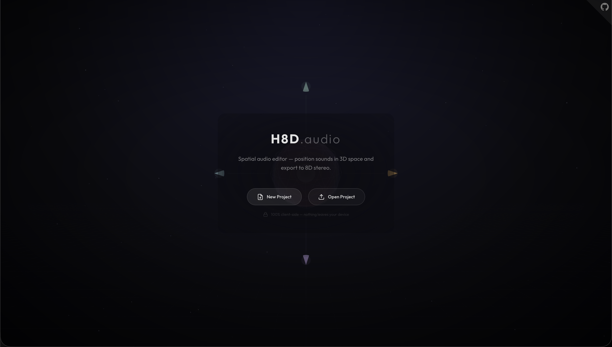
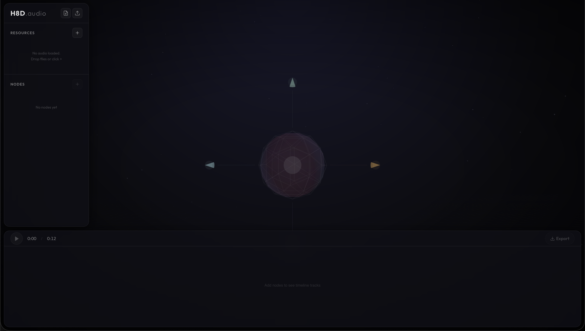

# H8D


H8D is a fully client-side spatial 8D audio editor with a keyframe timeline, powered by the Web Audio API and Three.js. It allows you to position sounds in 3D space, automate their movement, and export the result directly to an 8D stereo WAV file.

## Preview

<table align="center">
  <tr>
    <td align="center">
      
      <br>
      <i>Welcome Page</i>
    </td>
    <td align="center">
      
      <br>
      <i>Empty Project</i>
    </td>
  </tr>
  <tr>
    <td align="center">
      
      <br>
      <i>Single Node</i>
    </td>
    <td align="center">
      
      <br>
      <i>Multiple Nodes</i>
    </td>
  </tr>
</table>

## Features

- **Spatial 3D Audio Engine:** Position any audio track in a 3D environment by manipulating angle, distance, and height natively using the Web Audio API.
- **Keyframe Automation:** Fully featured timeline with keyframe support. Automate spatial parameters, volume, and muting over time to create complex 8D audio trajectories.
- **100% Client-Side Privacy:** Ultimate privacy and speed. No audio files are ever uploaded to a server. All processing, playback, and rendering happen directly within your browser.
- **Project Management:** Export your entire workspace as a `.h8d` project file and import it later to pick up exactly where you left off.
- **Direct WAV Export:** Bake your spatial movement into a finalized, ready-to-listen 8D stereo `.wav` file entirely on the client side.

## Project Structure

```text
h8d/
├── assets/          # Static assets and icons
├── src/             # TypeScript source code and modules
│   └── styles/      # Sass stylesheets (main.scss)
├── index.html       # Main application view
├── package.json     # Project dependencies and scripts
└── vite.config.ts   # Vite bundler configuration
```

## Setup & Development

This repository is maintained for development and contribution purposes. To run the project locally for contributing:

1. Install dependencies:
```bash
npm install
```

2. Start the development server:
```bash
npm run dev
```

3. Build for production:
```bash
npm run build
```

## Contributing

Contributions to improve the application, fix bugs, or add features are welcome. If you wish to contribute to this project:

1. Fork the repository.
2. Create a new branch for your feature or fix.
3. Commit and push your changes.
4. Open a Pull Request.

## License

This project and its source code are proprietary. You may view the source code and fork the repository exclusively for the purpose of contributing back via Pull Requests. All other uses are strictly prohibited.

For full details, please see the [LICENSE](LICENSE) file.

Copyright © 2026 Elias Dinar Ettouizi.
